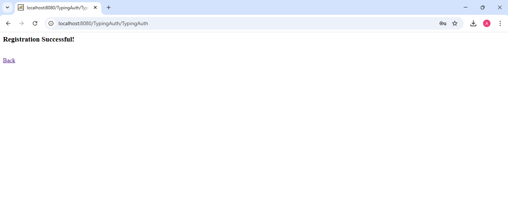
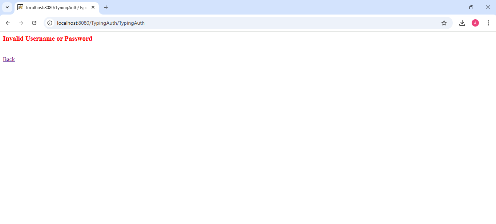

# 🔐 KeyAuth – Behavioral Biometric Authentication using Keystroke Dynamics

### 🧠 Advance Java Project

---

## 📌 Project Description

**KeyAuth** is an Advance Java based Behavioral Biometric Authentication System that enhances traditional password-based login security by analyzing the user's typing pattern (keystroke dynamics).

This system verifies not only the correctness of the password but also the way the user types it, providing an additional layer of security against unauthorized access.

It is developed using:

* Java Servlet Technology
* Apache Tomcat Server
* HTML Form Handling
* File Handling (for pattern storage)
* Behavioral Biometrics Concept

---

## 🎯 Features

✔ User Registration
✔ Login Authentication
✔ Typing Pattern Analysis
✔ Suspicious User Detection
✔ Password + Behavioral Verification
✔ Lightweight File-Based Database
✔ Secure Login System

---

## 🛠 Technologies Used

* Java
* Advanced Java (Servlet)
* Apache Tomcat Server
* HTML
* File Handling

---

## ⚙ System Requirements

* JDK 17 or above
* Apache Tomcat 10/11
* Web Browser
* Windows OS

---

## 🚀 How to Run the Project

### Step 1: Compile Servlet

```
javac -classpath ".;jakarta.servlet-api.jar" TypingAuth.java
```

---

### Step 2: Copy Class File to Tomcat

Paste the generated `.class` file into:

```
Tomcat/webapps/TypingAuth/WEB-INF/classes
```

---

### Step 3: Run Server

Start Apache Tomcat Server.

---

### Step 4: Open in Browser

```
http://localhost:8080/TypingAuth/TypingAuth
```

---

## 📸 Screenshots

### 🔹 Home Page


### 🔹 Registration Success



### 🔹 Login Verified


### 🔹 Suspicious User Blocked



---

## 🔍 Working Principle

The system records the typing speed pattern of the user during registration and stores it in a file.

During login:

* Password is verified
* Typing pattern is compared
* Match percentage is calculated

If match ≥ 75% → ✅ User Verified
If match < 75% → ❌ Suspicious Login Blocked

---

## 📚 Application

* Banking Systems
* Online Examination Systems
* Secure Login Platforms
* Fraud Detection Systems

---

## 👨‍💻 Created By

### **Yash Jain**

---

## 📜 License

This project is for educational purposes only.

---

